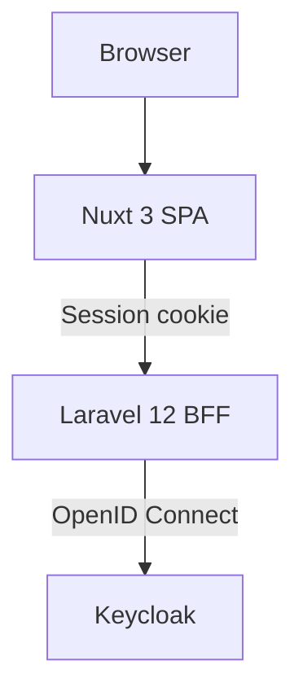

================================================================================
BAKERY SPA — Nuxt 4 + Laravel 12 + Keycloak
================================================================================

A full-stack Single Sign-On (SSO) demonstration using Nuxt 4, Laravel 12, and Keycloak.

A Nuxt 4 single-page application (SPA) delegates all authentication responsibilities to a Laravel 12 API acting as a Backend-for-Frontend (BFF). Laravel communicates with Keycloak using OpenID Connect (OIDC) and owns the authenticated server-side session.

The SPA never communicates directly with Keycloak and never receives, stores, or processes OIDC access tokens, ID tokens, or refresh tokens. It also stores no authentication secrets. Instead, the SPA communicates exclusively with the Laravel BFF, asking it questions such as “Who am I?” Laravel handles the authentication flow, maintains the server-side session, and returns only the necessary authenticated user information to the SPA, which then uses that information to render the appropriate application state.

================================================================================
ARCHITECTURE
================================================================================



================================================================================
KEY CHARACTERISTICS
================================================================================

Server-side authentication through Laravel

Keycloak SSO using OpenID Connect

Laravel Sanctum stateful SPA sessions

HttpOnly session-based authentication

Federated logout

No tokens stored in the browser

Nuxt SSR cookie forwarding

Explicit CORS and CSRF configuration

================================================================================
TABLE OF CONTENTS
================================================================================

  1. What This Project Does
  2. Architecture
  3. Requirements
  4. Setup Steps
  5. Directory Structure
  6. Configuration Reference
  7. Key Files (Full Source)
  8. Testing the SPA
  9. Common Errors and Fixes
 10. Production Migration Checklist
 11. Security Notes
 12. Related Projects

================================================================================
1. WHAT THIS PROJECT DOES
================================================================================

- Renders the user interface of the Bakery SSO demo
- Calls the Laravel API at /api/user to determine the current user
- Calls the Laravel API at /api/logout to end the session
- Redirects the browser to Laravel's /sso/redirect to begin the login flow
- Follows the Keycloak federated logout URL returned by Laravel on logout
- Shows the logged-in user's name and a Logout button in the navbar when a
  session exists
- Shows a Login link when no session exists

The SPA does NOT:

- Talk to Keycloak directly
- Handle OIDC tokens, PKCE, or discovery
- Store credentials or tokens in localStorage
- Know anything about client IDs or client secrets

================================================================================
2. ARCHITECTURE
================================================================================

  ```mermaid
  flowchart TD
      A[Browser] --> B[Nuxt<br/>localhost:3000]


  B -->|GET /api/user<br/>Session cookie| C[Laravel<br/>localhost:8000]
  B -->|POST /api/logout<br/>Session cookie| C
  B -->|GET /sso/redirect<br/>Browser navigation| C

  C -->|OIDC| D[Keycloak<br/>localhost:9000]
  ```

Two independent sessions exist:

  1. Keycloak's SSO session (cookie on localhost:9000)
     Owned by Keycloak. Determines whether the user is already logged in.

  2. Laravel's session (cookie on localhost, shared with this SPA)
     Owned by the Laravel API. Determines whether the SPA is recognized.

The SPA reads only the second one, indirectly, by calling /api/user.

================================================================================
3. REQUIREMENTS
================================================================================

- Node.js 20 or newer
- npm
- A running Laravel API on http://localhost:8000
  (See the bakery-api project README.)
- A running Keycloak on http://localhost:9000 with realm "myapp"
- A modern browser with DevTools

Check your Node version:

    node -v

================================================================================
4. SETUP STEPS
================================================================================

4.1  Create the Nuxt project

    npx nuxi@latest init bakery-spa
    cd bakery-spa

    Choose:
      Package manager: npm
      Initialize git: your choice
      Install dependencies: yes

4.2  Add Bootstrap via CDN

    No npm install needed. The nuxt.config.ts in Section 7 loads Bootstrap 5
    from jsdelivr.

4.3  Create the required source files

    Nuxt 4 uses app/ as the source directory. Create these files:

      app/app.vue
      app/composables/useAuth.ts
      app/layouts/default.vue
      app/pages/index.vue
      app/pages/login.vue
      app/pages/dashboard.vue

    Full contents are in Section 7.

4.4  Configure nuxt.config.ts

    At the project root. Full contents in Section 7.

4.5  Start the dev server

    npm run dev

    Nuxt listens on http://localhost:3000.

4.6  Ensure Laravel and Keycloak are running

    In separate terminals:

      cd bakery-api && php artisan serve              # localhost:8000
      cd ~/keycloak/keycloak-26.x.x && bin/kc.sh start-dev --http-port=9000

================================================================================
5. DIRECTORY STRUCTURE
================================================================================

    bakery-spa/
      nuxt.config.ts
      package.json
      app/
        app.vue
        composables/
          useAuth.ts
        layouts/
          default.vue
        pages/
          index.vue
          login.vue
          dashboard.vue

Note: In Nuxt 4, everything under app/ is treated as source. Files placed
at the project root (e.g. pages/ without the app/ prefix) will NOT be
picked up.

================================================================================
6. CONFIGURATION REFERENCE
================================================================================

Two runtime config values drive the entire integration:

  apiBase   http://localhost:8000
            Where the Laravel API lives. All fetch calls target this origin.

  loginUrl  http://localhost:8000/sso/redirect
            Where the browser navigates to start the OIDC login flow.

Ports used:

  Nuxt        localhost:3000
  Laravel     localhost:8000
  Keycloak    localhost:9000

Use localhost consistently (not 127.0.0.1). Cookie domains must match
between the SPA origin and the API origin for cross-origin sessions to work.

================================================================================
7. KEY FILES (FULL SOURCE)
================================================================================

--------------------------------------------------------------------------------
7.1  nuxt.config.ts
--------------------------------------------------------------------------------

export default defineNuxtConfig({
  compatibilityDate: '2025-01-01',
  devtools: { enabled: true },

  runtimeConfig: {
    public: {
      apiBase: 'http://localhost:8000',
      loginUrl: 'http://localhost:8000/sso/redirect',
    },
  },

  app: {
    head: {
      title: 'Bakery SSO',
      link: [
        {
          rel: 'stylesheet',
          href: 'https://cdn.jsdelivr.net/npm/bootstrap@5.3.3/dist/css/bootstrap.min.css',
        },
      ],
      script: [
        {
          src: 'https://cdn.jsdelivr.net/npm/bootstrap@5.3.3/dist/js/bootstrap.bundle.min.js',
          tagPosition: 'bodyClose',
        },
      ],
    },
  },
})

--------------------------------------------------------------------------------
7.2  app/app.vue
--------------------------------------------------------------------------------

<template>
  <NuxtLayout>
    <NuxtPage />
  </NuxtLayout>
</template>

--------------------------------------------------------------------------------
7.3  app/composables/useAuth.ts
--------------------------------------------------------------------------------

interface User {
  id: number
  name: string
  email: string | null
  oidc_issuer: string
  oidc_subject: string
}

export const useAuth = () => {
  const config = useRuntimeConfig()
  const user = useState<User | null>('auth.user', () => null)
  const loading = useState<boolean>('auth.loading', () => false)
  const initialized = useState<boolean>('auth.initialized', () => false)

  async function fetchUser(force = false): Promise<User | null> {
    if (initialized.value && !force) {
      return user.value
    }

    loading.value = true
    try {
      // useRequestFetch forwards the browser's cookies when running on the server
      const fetcher = useRequestFetch()

      const data = await fetcher<User>(`${config.public.apiBase}/api/user`, {
        credentials: 'include',
        headers: { Accept: 'application/json' },
      })
      user.value = data
      initialized.value = true
      return data
    } catch {
      user.value = null
      initialized.value = true
      return null
    } finally {
      loading.value = false
    }
  }

  function login(): void {
    if (import.meta.client) {
      window.location.href = config.public.loginUrl
    }
  }

  async function logout(): Promise<void> {
    let logoutUrl: string | null = null

    try {
      const fetcher = useRequestFetch()
      const data = await fetcher<{ message: string; logout_url?: string }>(
        `${config.public.apiBase}/api/logout`,
        {
          method: 'POST',
          credentials: 'include',
          headers: { Accept: 'application/json' },
        }
      )
      logoutUrl = data.logout_url ?? null
    } catch {
      // ignore — we are logging out anyway
    }

    user.value = null
    initialized.value = true

    if (import.meta.client) {
      if (logoutUrl) {
        // Federated: also end the Keycloak SSO session
        window.location.href = logoutUrl
      } else {
        window.location.href = '/'
      }
    }
  }

  return { user, loading, initialized, fetchUser, login, logout }
}

--------------------------------------------------------------------------------
7.4  app/layouts/default.vue
--------------------------------------------------------------------------------

<script setup lang="ts">
const { user, logout } = useAuth()
</script>

<template>
  <div class="d-flex flex-column min-vh-100">
    <nav class="navbar navbar-expand-lg navbar-dark bg-dark">
      <div class="container">
        <NuxtLink class="navbar-brand" to="/">Bakery SSO</NuxtLink>
        <div class="navbar-nav ms-auto">
          <template v-if="user">
            <NuxtLink class="nav-link" to="/dashboard">Dashboard</NuxtLink>
            <span class="nav-link disabled">{{ user.name }}</span>
            <button class="btn btn-link nav-link" @click="logout">Logout</button>
          </template>
          <template v-else>
            <NuxtLink class="nav-link" to="/login">Login</NuxtLink>
          </template>
        </div>
      </div>
    </nav>

    <main class="py-4 flex-grow-1">
      <slot />
    </main>

    <footer class="bg-light py-3 mt-auto text-center text-muted">
      <small>SSO Demo — Nuxt 4 + Laravel 12 + Keycloak</small>
    </footer>
  </div>
</template>

--------------------------------------------------------------------------------
7.5  app/pages/index.vue
--------------------------------------------------------------------------------

<script setup lang="ts">
const { user, fetchUser } = useAuth()

if (import.meta.client) {
  await fetchUser()
}
</script>

<template>
  <div class="container">
    <div class="text-center py-5">
      <h1 class="display-4 mb-3">Bakery SSO</h1>
      <p class="lead mb-4">Single Sign-On with Nuxt 4 + Laravel 12 + Keycloak</p>

      <div v-if="user">
        <p class="fs-5">Welcome back, <strong>{{ user.name }}</strong></p>
        <NuxtLink to="/dashboard" class="btn btn-primary btn-lg">
          Go to Dashboard
        </NuxtLink>
      </div>
      <div v-else>
        <NuxtLink to="/login" class="btn btn-primary btn-lg">Sign In</NuxtLink>
      </div>
    </div>
  </div>
</template>

--------------------------------------------------------------------------------
7.6  app/pages/login.vue
--------------------------------------------------------------------------------

<script setup lang="ts">
const { login } = useAuth()
</script>

<template>
  <div class="container">
    <div class="row justify-content-center">
      <div class="col-md-6">
        <div class="card shadow-sm">
          <div class="card-body p-5 text-center">
            <h1 class="h3 mb-3 fw-bold">Welcome</h1>
            <p class="text-muted mb-4">Sign in with your organization account</p>
            <button @click="login" class="btn btn-primary btn-lg w-100">
              Sign in with Keycloak SSO
            </button>
          </div>
        </div>
      </div>
    </div>
  </div>
</template>

--------------------------------------------------------------------------------
7.7  app/pages/dashboard.vue
--------------------------------------------------------------------------------

<script setup lang="ts">
const { user, fetchUser } = useAuth()

await fetchUser(true)
</script>

<template>
  <div class="container">
    <div v-if="user">
      <div class="alert alert-success">
        <strong>Authenticated!</strong>
      </div>

      <div class="card shadow-sm">
        <div class="card-header">
          <h2 class="h4 mb-0">Your Session</h2>
        </div>
        <div class="card-body">
          <table class="table table-borderless mb-0">
            <tbody>
              <tr>
                <th style="width: 200px;">Local User ID</th>
                <td>#{{ user.id }}</td>
              </tr>
              <tr>
                <th>Name</th>
                <td>{{ user.name }}</td>
              </tr>
              <tr>
                <th>Email</th>
                <td>{{ user.email ?? 'Not provided' }}</td>
              </tr>
              <tr>
                <th>OIDC Issuer</th>
                <td><code>{{ user.oidc_issuer }}</code></td>
              </tr>
              <tr>
                <th>OIDC Subject</th>
                <td><code>{{ user.oidc_subject }}</code></td>
              </tr>
            </tbody>
          </table>
        </div>
      </div>
    </div>

    <div v-else class="text-center py-5">
      <p class="text-danger fs-5">Not authenticated.</p>
      <NuxtLink to="/login" class="btn btn-primary">Go to Login</NuxtLink>
    </div>
  </div>
</template>

================================================================================
8. TESTING THE SPA
================================================================================

8.1  Start all three services

    Terminal 1 — Keycloak

      cd ~/keycloak/keycloak-26.x.x
      export JAVA_HOME=$(/usr/libexec/java_home -v 21)
      bin/kc.sh start-dev --http-port=9000

    Terminal 2 — Laravel

      cd bakery-api
      php artisan serve

    Terminal 3 — Nuxt

      cd bakery-spa
      npm run dev

8.2  Test: Full login flow

    1. Open a fresh incognito window
    2. Visit http://localhost:3000
    3. Click "Sign In" → lands on /login
    4. Click "Sign in with Keycloak SSO" → lands on Keycloak login form
    5. Enter testuser / Test1234
    6. Lands on /dashboard with the user's name and email visible
    7. Navbar shows Dashboard | user's name | Logout

8.3  Test: SSO session reuse

    1. Open a new tab in the same incognito window
    2. Visit http://localhost:3000/dashboard
    3. Should show the dashboard immediately — no password prompt

8.4  Test: Federated logout

    1. Click Logout in the navbar
    2. Browser navigates briefly to localhost:9000 (Keycloak)
    3. Keycloak clears its SSO session and redirects back to localhost:3000
    4. Home page shows Sign In
    5. Click Sign In → Keycloak now prompts for a password
       (This is the definitive test that federated logout worked.)

8.5  Test: Server-side rendering with cookies

    1. After logging in, refresh the dashboard
    2. The initial SSR pass forwards the session cookie through
       useRequestFetch(), so /api/user returns 200 during SSR as well

================================================================================
9. COMMON ERRORS AND FIXES
================================================================================

9.1  /api/user returns 401 despite a valid session

Cause: Sanctum's stateful middleware is missing on the Laravel side, OR
       the browser is not sending the session cookie cross-origin.

Fix (Laravel side):
  In bakery-api/bootstrap/app.php, ensure the middleware block calls:

    $middleware->statefulApi();

  Without it, Sanctum only looks for Bearer tokens and ignores the session.

Fix (Nuxt side):
  Ensure all fetch calls use:

    credentials: 'include'

  And in the composable, use useRequestFetch() so SSR requests forward
  cookies.

9.2  Session cookie missing from the browser

Cause: SESSION_DOMAIN in Laravel's .env is null or set to 127.0.0.1,
       while the browser is on localhost.

Fix:
  In bakery-api/.env:

    SESSION_DOMAIN=localhost
    APP_URL=http://localhost:8000
    FRONTEND_URL=http://localhost:3000

  Then run:

    php artisan config:clear

9.3  Configuration shows undefined at runtime

Symptom:
  Requests hit http://localhost:3000/undefined/api/user

Cause:
  Nuxt is serving a stale compiled runtime config.

Fix:

    rm -rf .nuxt node_modules/.cache
    npm run dev

9.4  Login button does nothing (page seems to reload)

Cause:
  window.location.href is being set to undefined because loginUrl is
  missing from runtimeConfig.

Fix:
  Verify nuxt.config.ts has:

    runtimeConfig: {
      public: {
        apiBase: 'http://localhost:8000',
        loginUrl: 'http://localhost:8000/sso/redirect',
      },
    },

9.5  After logout, clicking Sign In logs you back in without prompting

Cause:
  Only the Laravel session was cleared. Keycloak's SSO session is still
  alive, so Keycloak auto-authenticates on the next /auth request.

Fix:
  Ensure the logout function follows the logout_url returned by Laravel:

    if (logoutUrl) {
      window.location.href = logoutUrl
    }

  And ensure Laravel's logout controller returns that URL.

9.6  Keycloak shows "Invalid redirect uri" on logout

Cause:
  The post_logout_redirect_uri sent by Laravel does not exactly match
  what is registered in Keycloak.

Fix:
  In Keycloak admin → Clients → nuxt-laravel-bakery → Settings →
  Valid post logout redirect URIs, ensure the entry matches the value of
  FRONTEND_URL in Laravel's .env exactly. "http://localhost:3000" and
  "http://localhost:3000/" are treated as different values.

9.7  CSRF 419 on POST /api/logout

Cause:
  Sanctum's statefulApi() adds the web middleware group (including CSRF)
  to API routes. Cross-origin POSTs from the SPA don't carry the CSRF
  header.

Fix:
  In bakery-api/bootstrap/app.php:

    $middleware->validateCsrfTokens(except: ['api/*']);

================================================================================
10. PRODUCTION MIGRATION CHECKLIST
================================================================================

When moving this SPA from local development to production, only the
following values change. No source code changes are required.

In nuxt.config.ts (or via environment variables):

  Local                                       Production
  ---------------------------------------------------------------------------
  apiBase:  http://localhost:8000             https://api.company.com
  loginUrl: http://localhost:8000/sso/redirect https://api.company.com/sso/redirect

Because Nuxt reads these from runtimeConfig.public, they can be overridden
at runtime using environment variables without editing source:

  NUXT_PUBLIC_API_BASE=https://api.company.com
  NUXT_PUBLIC_LOGIN_URL=https://api.company.com/sso/redirect

Additional production considerations:

- Deploy the SPA behind HTTPS
- Deploy the API behind HTTPS
- Ensure the identity team registers the production redirect URIs
  (on the Laravel client, not on the SPA itself — the SPA never receives
  a callback)
- Do not store tokens in the SPA. The SPA never sees a token. Keep it
  that way.
- Keep the session cookie HttpOnly and Secure. This is set on the
  Laravel side; no SPA change required.

What does NOT change:

- app/composables/useAuth.ts
- app/layouts/default.vue
- app/pages/*.vue
- app/app.vue
- The shape of the API response

================================================================================
11. SECURITY NOTES
================================================================================

Rule 1 — The SPA is not a trust boundary

  Anything the SPA says about the user is unverified until the API confirms
  it. The SPA never sends user_id or role to the backend and expects it to
  be trusted. It sends the session cookie; Laravel decides.

Rule 2 — No tokens in the browser

  The SPA never holds an access token, ID token, or refresh token. All of
  that lives server-side in Laravel. This eliminates a whole class of XSS
  token-theft attacks.

Rule 3 — Decode is not validate

  Even if the SPA decoded a JWT for UI purposes, that would not authenticate
  the user. Authentication decisions belong on the backend.

Rule 4 — 401 vs 403

  The SPA should treat a 401 from any endpoint as "not authenticated" and
  redirect to login. A 403 means "authenticated but not allowed" — show an
  error, do not force re-login.

Rule 5 — Same-origin discipline

  Keep the SPA on one origin and the API on another, with explicit CORS.
  Never use a wildcard origin with credentials enabled.

================================================================================
12. RELATED PROJECTS
================================================================================

  bakery-api      Laravel 12 API acting as the OIDC client and BFF.
                  Owns the session, the user table, and the /api endpoints.
                  See its README for full backend setup.

  Keycloak        The Identity Provider. Realm "myapp", confidential client
                  "nuxt-laravel-bakery". See the project documentation for
                  the Keycloak setup.

================================================================================
END OF DOCUMENT
================================================================================